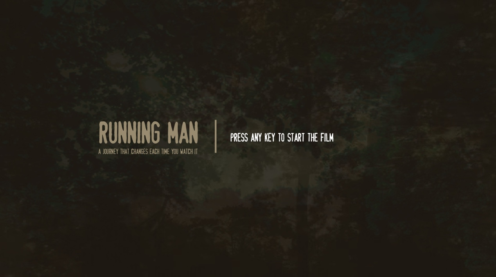
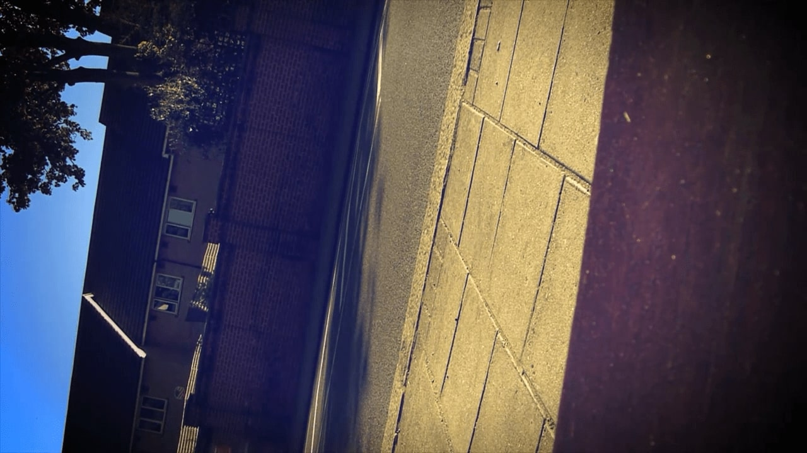
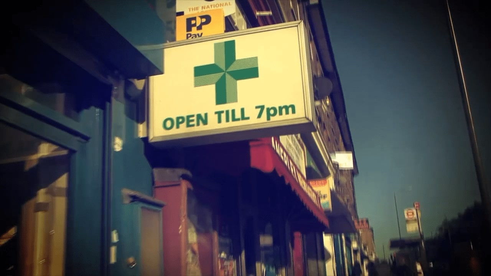
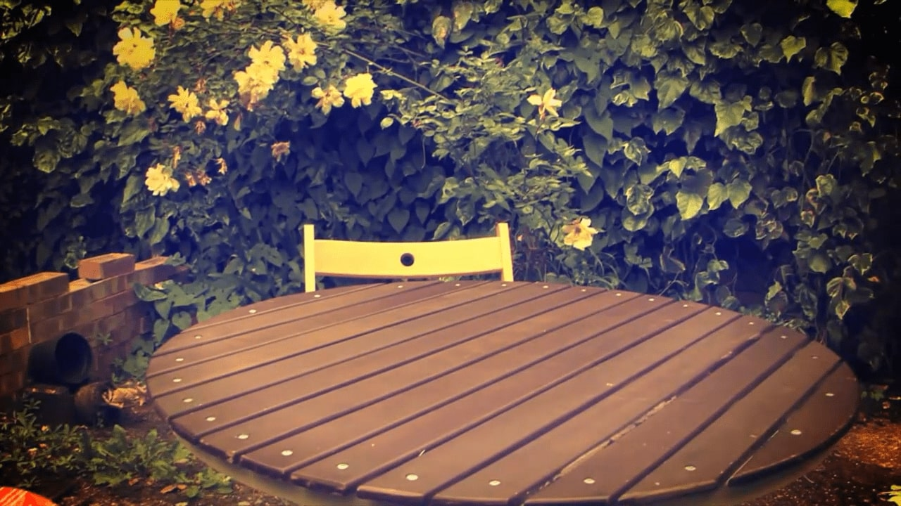
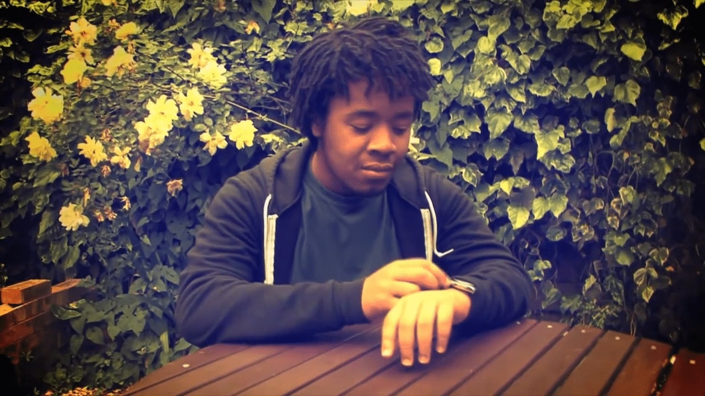
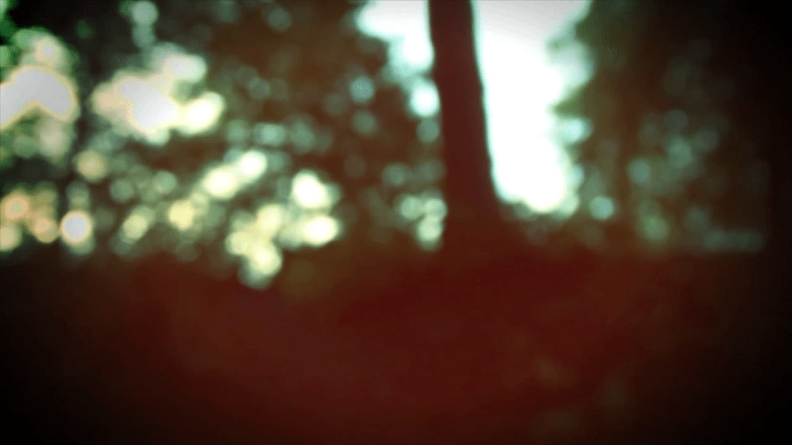
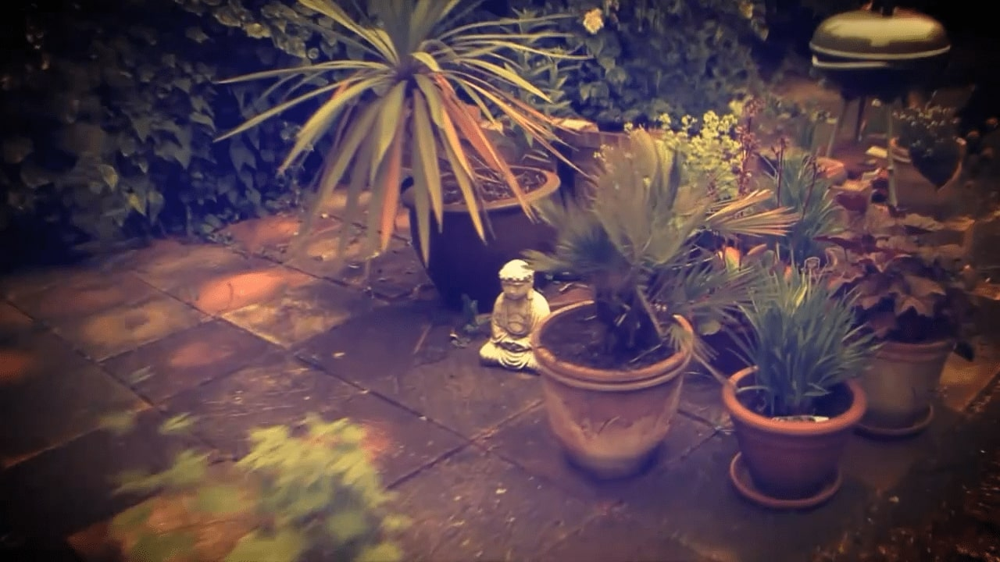
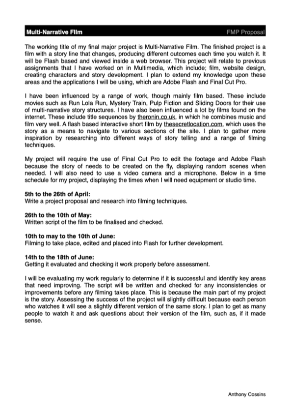
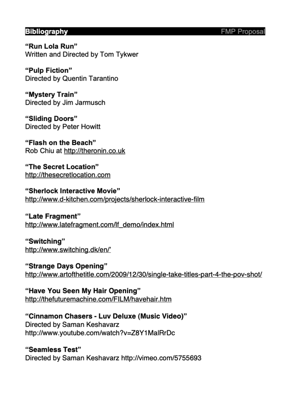
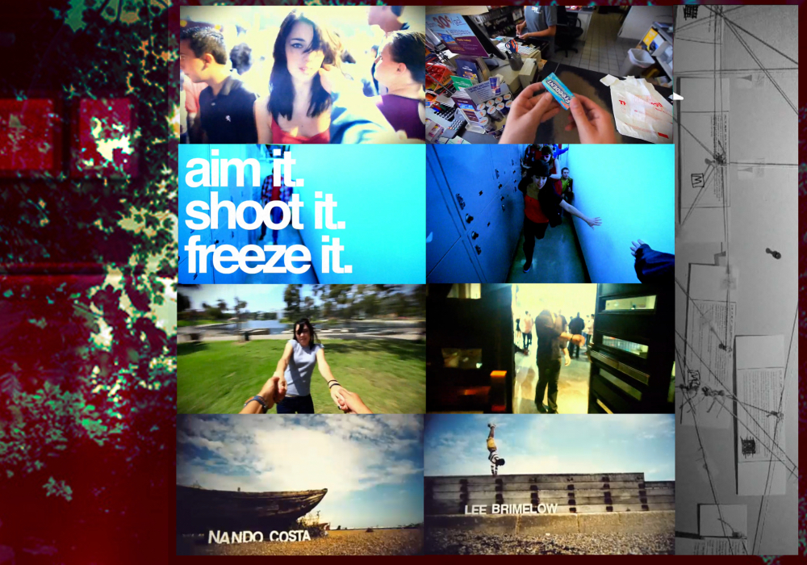

<!-- description: Dynamic film  that changes each time you watch it -->
<!-- type: installation -->

# Running Man

Running Man was my final major project in college (in the UK this is not university). It's a dynamic film, a journey that changes each time you watch it. The original was made in Adobe Flash with specific scenes being randomly swapped out on the fly.

This was my first fully completed project that involved programming.

I never released Running Man on the internet. This is because it was originally made to be shown in a exhibition like environment, with the video file loaded in one go from disk. However, for the internet, streaming is a better than loading all upfront. I was not confident that people would wait for it to download before they could watch it.

Also there isn't really a story to Running Man. I found it hard to describe without going straight into technicalities, which made it hard to come up with a description for submitting to websites.

## Video

Running Man does not work with [Ruffle](https://ruffle.rs/) (Flash Player emulator), but if you have the standalone [Flash Player projector](https://www.adobe.com/support/flashplayer/debug_downloads.html) then you can run the project by [downloading it](#assets).

Here is a "compiled" version of one viewing of Running Man.

<div class="youtube-embed">
  <div class="youtube-embed__video">
    <iframe width="560" height="315" src="https://www.youtube.com/embed/6aFpkF93als" title="YouTube video player" frameborder="0" allow="accelerometer; autoplay; clipboard-write; encrypted-media; gyroscope; picture-in-picture" allowfullscreen></iframe>
  </div>

  <a href="https://anthony-cossins-archive.s3.eu-west-1.amazonaws.com/2010-06-10-running-man/running_man_render.mov">Download video</a>
</div>

### Raw Footage

This is the raw footage that the project uses. For each scene there is a city and forest counter part. All the scenes are stored in one video file, and at specific cut points it will seek to a random scene.

<div class="youtube-embed">
  <div class="youtube-embed__video">
    <iframe width="560" height="315" src="https://www.youtube.com/embed/V71Yqt_Pkoo" title="YouTube video player" frameborder="0" allow="accelerometer; autoplay; clipboard-write; encrypted-media; gyroscope; picture-in-picture" allowfullscreen></iframe>
  </div>

  <a href="https://anthony-cossins-archive.s3.eu-west-1.amazonaws.com/2010-06-10-running-man/Video_Medium.f4v">Download video</a>
</div>

These are the more "interesting" clips from the raw footage. I think we filmed all of it in about 2 days. We filmed the city footage first and then spent a lot of time playing [Portal](https://en.wikipedia.org/wiki/Portal_(video_game)). Luckily it was summer so we still had enough light to go to the park and film the forest scenes.

The film was pretty much made up on the spot.

<div class="youtube-embed">
  <div class="youtube-embed__video">
    <iframe width="560" height="315" src="https://www.youtube.com/embed/8ZoFzTJovT8" title="YouTube video player" frameborder="0" allow="accelerometer; autoplay; clipboard-write; encrypted-media; gyroscope; picture-in-picture" allowfullscreen></iframe>
  </div>

  <a href="https://anthony-cossins-archive.s3.eu-west-1.amazonaws.com/2010-06-10-running-man/bits_of_raw_footage_render.mov">Download video</a>
</div>

Originally I wanted the experience to appear as one seamless take, but that's super difficult (and impossible for my skill level). Micah suggested having black frames put in through out to act as the main character blinking. Instead I went for just directly cutting, inspired by how [other first person films](#inspiration) were edited. But I think the blinking could've been cool.

This is all the raw footage I have from the project. Warning, it's very boring.

<div class="youtube-embed">
  <div class="youtube-embed__video">
    <iframe width="560" height="315" src="https://www.youtube.com/embed/5_k9ahfG9GM" title="YouTube video player" frameborder="0" allow="accelerometer; autoplay; clipboard-write; encrypted-media; gyroscope; picture-in-picture" allowfullscreen></iframe>
  </div>

  <a href="https://anthony-cossins-archive.s3.eu-west-1.amazonaws.com/2010-06-10-running-man/raw_footage.mov">Download video</a>
</div>

## Screenshots

Originally Running Man showed a screen saying "Press any key to start". This version was used at the final major project exhibition.



The main character can either wake up on a bench in the city or in a "forest" (it's actually [Crystal Palace park](https://en.wikipedia.org/wiki/Crystal_Palace_Park)).

<div class="project__image-side-by-side">

  

  

</div>

There is a chance for the main character to visit a local store. They'll steal something (a bag of pegs) which sets off a alarm causing them to flee.



<div class="project__image-side-by-side">

  

  

</div>

At the end you either meet your friend, who scorns you for being late. Or there's a chance that no one is there, and you sit opposite an empty chair. Are they late or are you early? I don't actually know, only just thought of that.

<div class="project__image-side-by-side">

  

  

</div>

## Making of

Final Cut Pro 7 was used to edit the footage. I don't remember but judging from the screenshot below it looks like I was playing around with making it more dreamy, overlaying video footage.


Snippet of ActionScript 2 code from the source project file. It's interesting to see how little code there is. There is probably only between 200-300 lines of code. And the bulk of the logic is in this snippet. [See full code snippet](assets/code_snippet.txt).

```as2
//...

onEnterFrame = function () {
  if (isPlaying == true) {
    realTime = ns.time;
    currentTime = int((ns.time)*10)/10;

    ///checkTime(Time to check The random number to check, firstOutcome:Number, secondOutcome:Number)

    ///CITY///
    checkTime(1.5,0,3,160.8);      //First start either waking up in city or woods
    checkTime(29,1,32,184.8);      //Phone blur transition
    checkTime(41,2,242,196.2);     //Black train transistion
    checkTime(56,3,42,211.9);      //Newspaper transisition
    gotoTime(88.8,240);            //After falling video
    checkTime(250.4,4,251,96);     //After getting up its either street or woods walk
    checkTime(132,5,131,286);      //Opening gate, different endings

    ///WOODS///
    checkTime(182.5,1,182.5,31);   //Phone blur transition
    checkTime(195,2,196,42);       //Black train transistion
    checkTime(211,3,211,57.5);     //Newspaper transisition
    gotoTime(237.2,83.5);          //On woods fall down, goto the falling video
    checkTime(95,4,96,250);        //After getting up its either street or woods walk
    checkTime(285,5,286,134);      //Opening gate, different endings
    timeFunction(301.8,initVideo); //Finish video
    timeFunction(150,initVideo);
  }
};
//..
```

<div class="project__image-side-by-side">

  [](assets/2010-04-19-propsal.pdf)

  [](assets/2010-04-28-bibliography.pdf)

</div>

## Inspiration

This is the moodboard that depicted the style I wanted to go for. It's funny seeing this old inspiration and how dated it is now. Back then Instagram style colour grading and vignettes were in fashion.



These are clips from my main inspirations of the project.

<div class="youtube-embed">
  <div class="youtube-embed__video">
    <iframe width="560" height="315" src="https://www.youtube.com/embed/sBAJKs5iOQ0" title="YouTube video player" frameborder="0" allow="accelerometer; autoplay; clipboard-write; encrypted-media; gyroscope; picture-in-picture" allowfullscreen></iframe>
  </div>

  <a href="https://anthony-cossins-archive.s3.eu-west-1.amazonaws.com/2010-06-10-running-man/running_man_inspiration.mov">Download video</a>
</div>

This is the "bibliography" for Running Man. A lot of the links are probably broken now.

Most of the inspiration is from smaller projects found on YouTube, Vimeo or other interactive films made in Flash. There's mentions of bigger films, though I think I only included those to make the list more legit. For instance, I've never seen Mystery Train or Sliding Doors. I'm not sure why I included them.

> “Run Lola Run”
> Written and Directed by Tom Tykwer
>
> “Pulp Fiction”
> Directed by Quentin Tarantino
>
> “Mystery Train”
> Directed by Jim Jarmusch
>
> “Sliding Doors”
> Directed by Peter Howitt
>
> “Flash on the Beach”
> Rob Chiu at http://theronin.co.uk
>
> “The Secret Location”
> http://thesecretlocation.com
>
> “Sherlock Interactive Movie”
> http://www.d-kitchen.com/projects/sherlock-interactive-film
>
> “Late Fragment”
> http://www.latefragment.com/lf_demo/index.html
>
> “Switching”
> http://www.switching.dk/en/ʼ
>
> “Strange Days Opening”
> http://www.artofthetitle.com/2009/12/30/single-take-titles-part-4-the-pov-shot/
>
> “Have You Seen My Hair Opening”
> http://thefuturemachine.com/FILM/havehair.htm
>
> “Cinnamon Chasers - Luv Deluxe (Music Video)”
> Directed by Saman Keshavarz http://www.youtube.com/watch?v=Z8Y1MalRrDc
>
> “Seamless Test”
> Directed by Saman Keshavarz http://vimeo.com/5755693

## Credits

- [Micah Gordon](http://micahgordon.com/) - Helped with filming and also lent me a fancier camera which he borrowed from the Brit School lol

## Assets

- [Download finished project](https://anthony-cossins-archive.s3.eu-west-1.amazonaws.com/2010-06-10-running-man/running_man.zip)
- [Download font](assets/Stamp.ttf)
- [Download source](assets/Running_Man.fla)
- [Download source video](https://anthony-cossins-archive.s3.eu-west-1.amazonaws.com/2010-06-10-running-man/Video_Medium.f4v)
